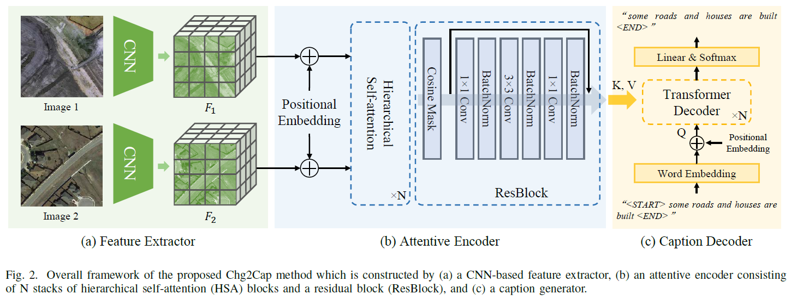
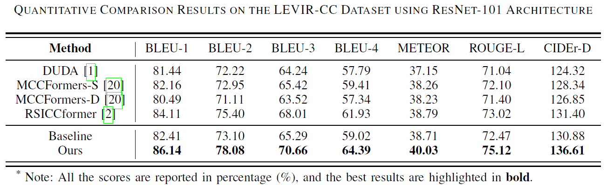
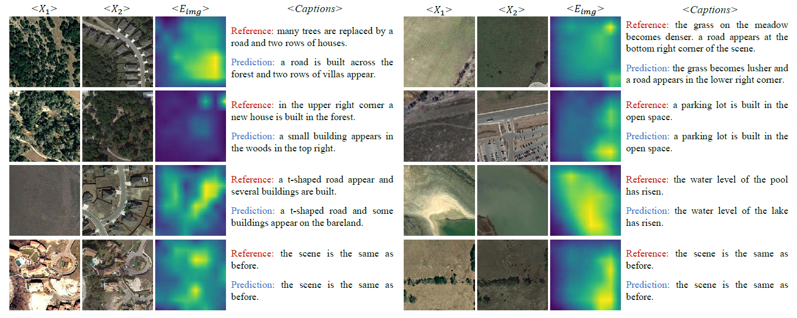

<h1 align="center">Changes to Captions: An Attentive Network for Remote Sensing Change Captioning</h1>

<h3 align="center"> Shizhen Chang and <a href="https://www.ai4rs.com/">Pedram Ghamisi</a></h3>
<br


    
This is the official PyTorch implementation of **[Changes to Captions: An Attentive Network for Remote Sensing Change Captioning](https://arxiv.org/abs/2304.01091)**, a project conducted at the [Institute of Advanced Research in Artificial Intelligence (IARAI)](https://www.iarai.ac.at/).


### Preparation
- Install the required packages: `pip install -r requirements.txt`
- Download the remote sensing change captioning datasets. We have adopted [LEVIR-CC](https://github.com/Chen-Yang-Liu/RSICC) in this repository.
- The data structure of LEVIR-CC is organized as follows:

```
├─/root/Data/LEVIR_CC/
        ├─LevirCCcaptions.json
        ├─images
             ├─train
             │  ├─A
             │  ├─B
             ├─val
             │  ├─A
             │  ├─B
             ├─test
             │  ├─A
             │  ├─B
```
where folder A contains images of pre-phase, folder B contains images of post-phase.

- Extract text files for the change descriptions of each image pair in LEVIR-CC:

```
$ python preprocess_data.py
```

!NOTE: When preparing the text token files, we suggest setting the word count threshold of LEVIR-CC to 5 and Dubai_CC to 0 for fair comparisons.
### Training
- Ensure you have completed the data preparation steps above, and then proceed to train the model as follows:
```
$ python train.py
```

!NOTE: If the program encounters the error: "'Meteor' object has no attribute 'lock'," we recommend installing it with `sudo apt install openjdk-11-jdk` to resolve this issue.

Alternatively, you can obtain our pretrained models from [Google Drive](https://drive.google.com/file/d/1phoO1BvPsRwIOIykkLm6acBpIocz9liz/view?usp=drive_link).

### Caption Generation
- To generate captions, run the following command:
```
$ python test.py
```

### Quantitative Evaluation and Visual Examples

- Quantitative evaluations of Chg2Cap compared to other state-of-the-art (SOTA) methods in LEVIR-CC are illustrated as follows:



Here are some visualized examples of the generated captions in LEVIR-CC:




### Paper
**[Changes to Captions: An Attentive Network for Remote Sensing Change Captioning](https://arxiv.org/abs/2304.01091)**

Please cite the following paper if you find it useful for your research:

```
@article{chg2cap,
  title={Changes to Captions: An Attentive Network for Remote Sensing Change Captioning},
  author={Chang, Shizhen and Ghamisi, Pedram},
  journal={IEEE Trans. Image Process.}, 
  doi={10.1109/TIP.2023.3328224},
  year={2023}
}
```

### Acknowledgement

The authors would like to thank the contributors to the [LEVIR-CC](https://github.com/Chen-Yang-Liu/RSICC/tree/main) and [Dubai-CC](https://disi.unitn.it/~melgani/datasets.html) datasets.

### License
This repo is distributed under [MIT License](https://github.com/ShizhenChang/Chg2Cap/LICENSE). The code can be used for academic purposes only.
