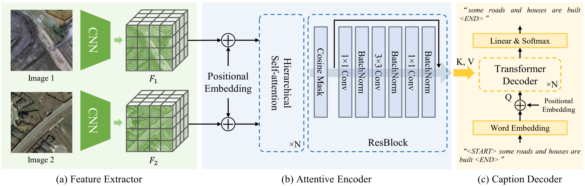

<h1 align="center">Changes to Captions: An Attentive Network for Remote Sensing Change Captioning</h1>

<h3 align="center"> Shizhen Chang and <a href="https://www.ai4rs.com/">Pedram Ghamisi</a></h3>
<br

*This research has been conducted at the [Institute of Advanced Research in Artificial Intelligence (IARAI)](https://www.iarai.ac.at/).*
    
This is the official PyTorch implementation of the paper **[Changes to Captions: An Attentive Network for Remote Sensing Change Captioning](https://arxiv.org/abs/2304.01091)**.
    

### Implementation
Coming soon!
